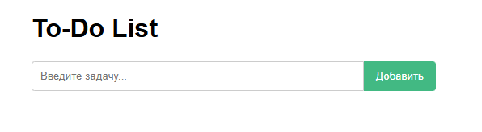
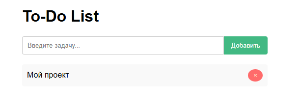
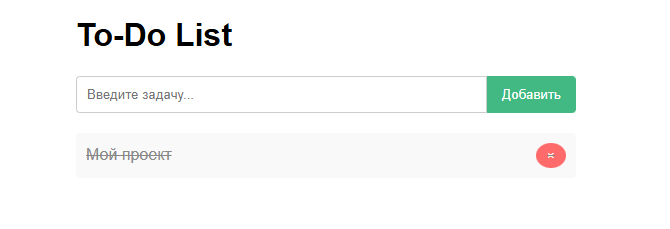

### Запуск To do list 
# 1) проверка установки Node
 node -v
 npm -v
-----
# 2) Клонирование проекта
   git clone https://github.com/MajestY999/TOODU.git
   cd TOODU-main
------
# 3) установка зависимостей 
npm install 
-----
# 4) Запуск проекта 
npm run dev
-----
## После появится ссылка на рабосий проект 

http://localhost:5173/TOODU

# Изобрание того, что лист задач работает, а также задачи добаляются.

# Можно зачеркнуть задачу 

